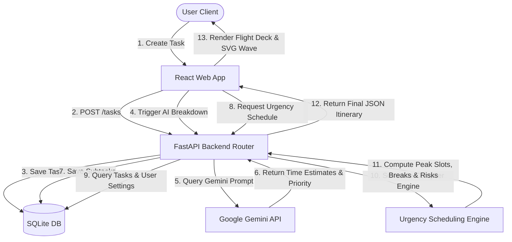

# 🧭 DeadlinePilot

### *AI-Powered Productivity Companion for Smart Task Execution*

<div align="left">

[](https://react.dev/)
[](https://www.typescriptlang.org/)
[](https://fastapi.tiangolo.com/)
[](https://deepmind.google/technologies/gemini/)
[](https://vite.dev/)
[](https://www.sqlite.org/)
[](https://firebase.google.com/)
[](https://railway.app/)

</div>

---

<div align="left">

[](https://deadlinepilot-cd0a8.web.app)
[](https://deadlinepilot-production.up.railway.app/docs)
[](https://github.com/KarthikUnnikrishnan/DeadlinePilot)

</div>

---

## 📖 Project Overview

**DeadlinePilot** acts as an autonomous autopilot cockpit for your daily workload. It is designed to navigate complex timelines by breaking down monolithic projects into manageable, time-estimated checklists, automatically mapping them to your biological energy peak hours, and constantly verifying if you have enough waking time remaining to prevent missed checkpoints.

---

## ⚡ Problem Statement

Traditional todo list apps are passive storage containers. They let you pile up tasks but do not account for:
1. **Task paralysis**: Complex tasks (e.g. "Write Research Thesis") are too big to start without granular checklists.
2. **Biological energy mismatch**: Placing highly demanding tasks during low energy slots (e.g. late night) leading to burnout or low quality output.
3. **Workload blindspots**: Having 10 hours of work due in 5 hours, with no warning.
4. **Panic overload**: Getting overwhelmed when a deadline lands within 24 hours.

**DeadlinePilot** solves this by actively orchestrating schedules, calculating workload risk coefficients, and auto-initiating Panic Mode to secure delivery.

---

## ✨ Core Features

*   **AI Task Breakdown (Google Gemini)**: Automatically decomposes complex, high-level task descriptions into subtask checklists with precise time estimates in minutes.
*   **Urgency Scheduling Engine**: Creates an hourly timeline placing critical task items during peak performance slots, respecting personalized wake, sleep, and break parameters.
*   **Cockpit Risk Engine**: Compares total remaining workload time against actual available waking hours. Triggers dynamic warning alerts (**Safe, Medium, High, or Critical**).
*   **🚨 Panic Mode**: Auto-triggers when any deadline falls under 24 hours. Emergency schedule rules apply: low-priority items are hidden, break buffers are set to 0m, and daily focus limits are extended to 12 hours.
*   **📊 Progress Analytics Hub**: Displays active streaks (with glowing animations), completion percentages, total focus time clocked, and a customized **SVG Biological Energy & Sleep Cycle wave chart** plotting your productivity parameters.
*   **🤖 AI Weekly Review**: Analyzes performance to calculate an overall Productivity Score, lists completed vs. overdue checkpoints, and generates custom tips from the AI Pilot Coach.
*   **Smart Empty States**: Offers pre-configured task templates (e.g. Auth API refactoring, cleaning workspace) that populate the system with a single click during demonstrations.

---

## 📐 System Architecture



---

## 📂 Folder Structure

```text
DeadlinePilot/
├── backend/                  # FastAPI Backend Server
│   ├── app/
│   │   ├── routers/
│   │   │   ├── tasks.py      # Tasks & Subtasks API router
│   │   │   └── schedule.py   # Scheduling & Settings API router
│   │   ├── services/
│   │   │   └── gemini.py     # Google Gemini API connector
│   │   ├── database.py       # SQLite connection parameters
│   │   ├── models.py         # SQLAlchemy schemas (Task, Subtask, Settings)
│   │   ├── schemas.py        # Pydantic validation schemas
│   │   ├── crud.py           # Database CRUD utility functions
│   │   └── main.py           # Main application router entry point
│   ├── requirements.txt      # Python dependencies
│   └── run.py                # Backend dev launcher script
├── frontend/                 # Vite + React (TypeScript) App
│   ├── src/
│   │   ├── components/
│   │   │   ├── LandingPage.tsx   # Product tour & timeline simulator
│   │   │   ├── TaskDashboard.tsx # Flight deck tabs, analytics & review
│   │   │   ├── TaskCard.tsx      # Task block card with checklist drawer
│   │   │   └── TaskForm.tsx      # Add/edit task modal
│   │   ├── api.ts            # Frontend HTTP client API helper
│   │   ├── App.tsx           # Route layout switcher container
│   │   ├── index.css         # CSS variables & scrollbar styles
│   │   └── main.tsx          # App mounter with Router context
│   ├── package.json          # Frontend dependencies
│   └── vite.config.ts        # Vite configuration script
└── README.md                 # Project Documentation
```

---

## 🛠️ Installation & Setup

### Prerequisites
- Python 3.9+
- Node.js 18+
- Google Gemini API Key (Optional: system falls back to mock breakdown compiler if no key is configured)

### 1. Backend Server Setup
1. Navigate to the backend directory:
   ```bash
   cd backend
   ```
2. Create and activate a Python virtual environment:
   ```bash
   # Windows (PowerShell)
   python -m venv venv
   .\venv\Scripts\Activate.ps1

   # macOS/Linux
   python3 -m venv venv
   source venv/bin/activate
   ```
3. Install dependencies:
   ```bash
   pip install -r requirements.txt
   ```
4. Set up environment variables inside a `.env` file in the `backend/` folder:
   ```env
   GEMINI_API_KEY=your_gemini_api_key_here
   ```
5. Run the FastAPI development server:
   ```bash
   python run.py
   ```
   *The backend documentation will be accessible at [http://localhost:8000/docs](http://localhost:8000/docs).*

### 2. Frontend client Setup
1. Navigate to the frontend directory:
   ```bash
   cd frontend
   ```
2. Install npm dependencies:
   ```bash
   npm install
   ```
3. Start the Vite React development server:
   ```bash
   npm run dev
   ```
   *Open [http://localhost:5173](http://localhost:5173) in your browser to enter the cockpit.*

---

## 🔗 Deployment Details

- **Frontend Deployment (Firebase Hosting)**:
  👉 [https://deadlinepilot-cd0a8.web.app](https://deadlinepilot-cd0a8.web.app)
- **Backend Deployment (Railway)**:
  👉 [https://deadlinepilot-production.up.railway.app](https://deadlinepilot-production.up.railway.app)
- **Interactive Swagger API Docs**:
  👉 [https://deadlinepilot-production.up.railway.app/docs](https://deadlinepilot-production.up.railway.app/docs)

---

## 📸 Interface Preview

*(Add your screenshots here)*

| 🧭 Dashboard Cockpit (Flight Deck) | 📊 Biological Energy Wave Curve |
|---|---|
|  |  |

---

## 🚀 Future Roadmap

- [ ] **Google Calendar Sync**: Sync AI-compiled subtask blocks directly to your primary calendar.
- [ ] **Wearable API Integration**: Adjust peak focus hours based on sleep duration/scores collected from Oura or Apple Health.
- [ ] **Multiplayer Squads**: Coordinate task breakdowns and allocate shared workloads across teams.
- [ ] **Push Notifications**: Receive alerts on desktop/mobile when a break block is concluding or a cognitive peak slot is starting.

---

## 🤝 Contribution

Contributions are welcome! Please feel free to open issues or submit pull requests.
1. Fork the project.
2. Create your Feature Branch (`git checkout -b feature/AmazingFeature`).
3. Commit your changes (`git commit -m 'Add some AmazingFeature'`).
4. Push to the Branch (`git push origin feature/AmazingFeature`).
5. Open a Pull Request.

---

## 📄 License

Distributed under the **MIT License**. See `LICENSE` for more information.

---

## 👤 Author

**Karthik Unnikrishnan**
- GitHub: [@KarthikUnnikrishnan](https://github.com/KarthikUnnikrishnan)
- LinkedIn: [Karthik Unnikrishnan](https://www.linkedin.com/in/)
